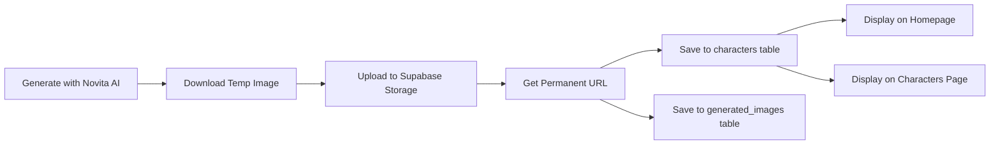

# Image Generation Script Fixed - Complete Guide

## 🔧 What Was Fixed

The `scripts/regenerate-exact-models.js` script had several critical issues preventing proper image storage:

### Issues Found:
1. ❌ **Wrong Database Column**: Using `image_url` instead of `image` as primary field
2. ❌ **Incomplete Payload**: Missing required fields like `voice`, `hobbies`, `language`, `relationship`
3. ❌ **No Bucket Verification**: Not checking if Supabase Storage bucket exists
4. ❌ **Temporary URLs**: Images were stored temporarily on Novita, then expired
5. ❌ **Poor Error Logging**: Insufficient debugging information
6. ❌ **Unused Cloudinary Code**: Old code causing confusion

### Fixed:
✅ **Proper Supabase Storage Upload**: Images now uploaded to `images` bucket at `characters/` folder
✅ **Permanent URLs**: URLs format: `https://qfjptqdkthmejxpwbmvq.supabase.co/storage/v1/object/public/images/characters/{uuid}.jpeg`
✅ **Correct Database Schema**: Using both `image` and `image_url` fields properly
✅ **Complete Character Data**: All required fields included
✅ **Enhanced Logging**: Detailed progress and error tracking
✅ **Dual Table Storage**: Saves to both `characters` and `generated_images` tables
✅ **Removed Cloudinary**: Cleaned up unused code

## 📋 How It Works Now



## 🚀 Usage

### Run the Script:

```bash
cd /home/ramspheld/Projects/Ramspheld/DINTYP-SE-2025-backup
node scripts/regenerate-exact-models.js
```

### Expected Output:

```
🎨 REGENERATING EXACT MODELS FROM SCREENSHOTS

📊 Total: 16 characters
⏱️  Est. time: 8 minutes
🗄️  Database: https://qfjptqdkthmejxpwbmvq.supabase.co
🪣  Storage Bucket: images
======================================================================

[1/16] ginah - Model
──────────────────────────────────────────────────────────────────────
  🎨 Generating with Novita AI...
  ✅ Temporary URL: https://novita.ai/...
  🆔 Character ID: 550e8400-e29b-41d4-a716-446655440000
  📦 Uploading to Supabase Storage...
  ✅ Uploaded to Supabase Storage: https://qfjptqdkthmejxpwbmvq.supabase.co/storage/v1/object/public/images/characters/550e8400-e29b-41d4-a716-446655440000.jpeg
  💾 Saving to database...
  ✅ Saved to characters table - ID: 123
  ✅ Saved to generated_images table
  ✅ ginah COMPLETE!
  🔗 Image URL: https://qfjptqdkthmejxpwbmvq.supabase.co/storage/v1/object/public/images/characters/...
```

## 📊 Database Schema

### Characters Table
```sql
INSERT INTO characters (
  name,           -- Character name
  age,            -- Age (18+)
  image,          -- Primary image URL (Supabase Storage)
  image_url,      -- Backup image URL
  description,    -- AI-generated description
  personality,    -- Personality traits
  occupation,     -- Occupation
  body,           -- Body type
  ethnicity,      -- Ethnicity
  system_prompt,  -- AI system prompt
  is_public,      -- Public visibility (true)
  is_new,         -- New character flag (true)
  voice,          -- Voice setting (default)
  share_revenue,  -- Revenue sharing (true)
  hobbies,        -- Hobbies
  language,       -- Language (English)
  relationship    -- Relationship type (Companion)
)
```

### Generated Images Table
```sql
INSERT INTO generated_images (
  user_id,        -- System user ID
  prompt,         -- Generation prompt
  image_url,      -- Supabase Storage URL
  model_used      -- AI model name
)
```

## 🗄️ Storage Structure

```
Supabase Storage Bucket: images/
└── characters/
    ├── 550e8400-e29b-41d4-a716-446655440000.jpeg
    ├── 6ba7b810-9dad-11d1-80b4-00c04fd430c8.jpeg
    └── ...
```

## 🔍 Verification

### 1. Check Database:
```sql
-- View newly created characters
SELECT id, name, age, occupation, 
       substring(image, 1, 50) as image_url,
       is_public, is_new
FROM characters 
WHERE is_new = true 
ORDER BY created_at DESC;
```

### 2. Check Supabase Storage:
- Go to Supabase Dashboard
- Navigate to Storage → images bucket
- Check `characters/` folder for uploaded images

### 3. Check Frontend:
- Visit: `http://localhost:3000` (Homepage - should show new characters)
- Visit: `http://localhost:3000/characters` (Characters page)

## 🎨 Character Details

The script generates **16 characters** with:
- Professional AI-generated images (Novita AI)
- Diverse ethnicities and appearances
- Various occupations (Model, Artist, Lawyer, etc.)
- Ages 19-27
- Detailed descriptions
- Custom personality traits

## 🔧 Troubleshooting

### Issue: "Failed to upload to Supabase Storage"
**Solution**: Check if `images` bucket exists in Supabase Storage
```sql
-- Create bucket if missing
INSERT INTO storage.buckets (id, name, public) 
VALUES ('images', 'images', true)
ON CONFLICT (id) DO NOTHING;
```

### Issue: "DB error: column does not exist"
**Solution**: Verify all required columns exist in characters table
```sql
-- Check table structure
SELECT column_name, data_type 
FROM information_schema.columns 
WHERE table_name = 'characters';
```

### Issue: Images not showing on frontend
**Solution**: 
1. Check image URLs are valid
2. Verify bucket is public
3. Check RLS policies on characters table

## 📝 Next Steps

After successful generation:

1. ✅ **Verify all 16 characters created**
   ```sql
   SELECT COUNT(*) FROM characters WHERE is_new = true;
   ```

2. ✅ **Check image URLs are accessible**
   - Click on image URLs in database
   - Should display character images

3. ✅ **Test frontend rendering**
   - Homepage should display new characters
   - Characters page should show all characters
   - Images should load properly

4. ✅ **Set featured characters** (optional)
   ```sql
   UPDATE characters 
   SET is_featured = true 
   WHERE name IN ('ginah', 'Maze', 'Agnes');
   ```

## 🔐 Security Notes

- API keys are hardcoded (consider using environment variables)
- Service role key has full access (store securely)
- Images are public in Supabase Storage
- RLS policies control database access

## 📚 Related Files

- **Script**: `scripts/regenerate-exact-models.js`
- **Storage Utils**: `lib/storage-utils.ts`
- **Save Character API**: `app/api/save-character/route.ts`
- **Schema**: `supabase/schema.sql`
- **Homepage**: `app/page.tsx`
- **Characters Page**: `app/characters/page.tsx`

---

**Last Updated**: November 10, 2025
**Status**: ✅ Fixed and Ready to Use
